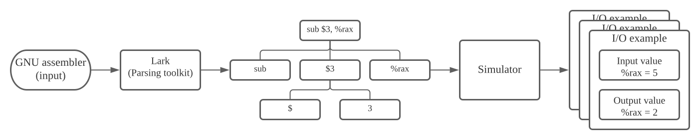
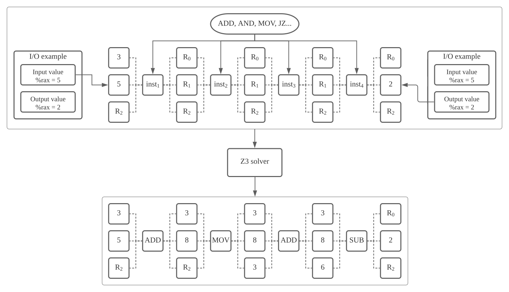

# hibari
SMTソルバによる命令列生成を用いた，GNU assemblerの難読化ツール．

## 仕組み
入力されたGNU assemblerの各コード（命令列）に対して，以下の手順を繰り返し適用することで難読化を行う．

1. 難読化対象コード（命令列）の入出力例を求める

1. SMTソルバを用いて，入出力例を満たす任意長のコードを求める

1. 得られた結果をもとにコードを生成する
1. コードに対して多数の入出力例を用いたテストを行う．パスできなければ1.へ戻る．
1. 難読化対象コードと生成されたコードを置換する

## Requirement
* Python 3.9 (or higher)
* z3py
* lark-python

## Usage
```
usage: obfuscator.py [-h] [-o O] [-n N] [-l L] src

positional arguments:
  src         Path of input file.

optional arguments:
  -h, --help  show this help message and exit
  -o O        Path of output file.
  -n N        Maximum number of lines to obfuscate at once.
  -l L        Number of instructions used for obfuscation.
```

## Example
```bash
python obfuscator.py target.s -o out.s
```