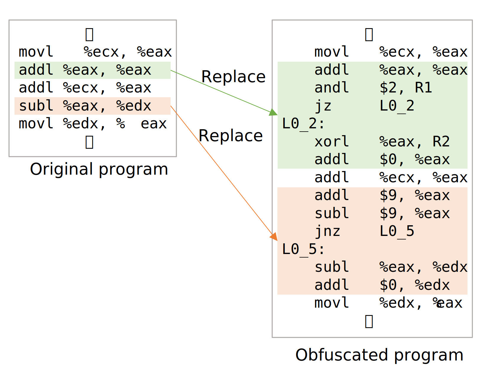

# hibari
*hibari* is an experimental obfuscator for the assembly language, which aims to protect software against Man-at-the-end attacks.
Hibari takes an assembly program (in the GNU assembler format) as input, and returns an obfuscated assembly program as output.
In hibari, some code fragments included in the target program are replaced with *obscure* fragments, preserving their semantics. The obscure fragments are generated using an SMT solver Z3.



## Requirements
* Python 3.9 (or higher)
* z3py
* lark-python

## Usage
```
usage: obfuscator.py [-h] [-o O] [-n N] [-l L] src

positional arguments:
  src         Path of input file.

optional arguments:
  -h, --help  show this help message and exit
  -o O        Path of output file.
  -n N        Maximum number of lines to obfuscate at once.
  -l L        Number of instructions used for obfuscation.
```

### Example
```bash
python3.9 obfuscator.py target.s -o out.s
```

## Reference
* 光本智洋，神崎雄一郎，&ldquo;SMTソルバによる命令列生成を用いたアセンブリプログラムの難読化，&rdquo; 情報処理学会 第83回全国大会講演論文集 (講演番号2K-04)，2021年3月．

