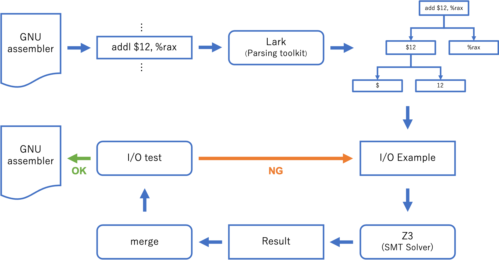

# hachi-obfuscator
SMTソルバによる命令列生成を用いた，GNU assemblerの難読化ツール．



# Requirement
* Python 3.9 (or higher)
* z3py
* lark-python

# Usage
```bash
python obfuscator.py target-path [-o path]
```

# Example
```bash
python obfuscator.py target.s -o out.s
```
